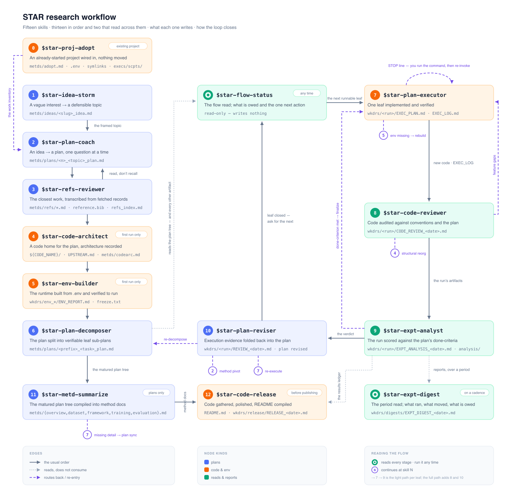

# 研究工作流 Skills 使用指南

**语言：** [English](research-workflow-skills.md) | 简体中文

STAR 提供十五个相互衔接的研究工作流 skill，用于把一个模糊的研究兴趣逐步变成有文献扫描背书的研究选题、可追踪的计划、有可核验文献库的相关工作基础、有架构记录的代码库、经过验证的运行环境、可执行的任务、有验证记录的实现、对照规范审计过的代码、对照预期审计过的实验结果、按时间轴记录下来的阶段进展、能吸收执行结果的计划、从这些计划反向编译出的方法文档，以及最后一份陌生人可以直接 clone 的仓库：

```text
已经开工的项目
  → star-proj-adopt：不改动原有内容地接入 STAR，并清点已经做完的工作

模糊的研究兴趣
  → star-idea-storm：发散、扫描领域、收敛出研究选题
  → star-plan-coach：形成总体研究计划
  → star-refs-reviewer：精读最接近的工作并建立可核验的文献库
  → star-code-architect：为计划搭建代码库并写下架构规范
  → star-env-builder：构建并验证运行环境
  → star-plan-decomposer：拆成有依赖关系的执行子计划
  → star-plan-executor：实现并验证一个叶子子计划
  → star-code-reviewer：对照规范与计划审计实现代码
  → star-expt-analyst：对照计划的预期审计这个 run 的结果
  → star-plan-reviser：以执行证据审查计划并修订
  → star-metd-summarize：所有叶子执行完、计划定稿后，把计划编译成方法文档
  → star-code-release：收集代码并编译出项目自己的 README

  ⌾ star-expt-digest：按周期横向通读整个循环——
    本阶段实验做了什么、什么发生了变化
  ⌾ star-flow-status：随时通读上述全部产物——
    进度到哪里、还欠什么、下一步该做哪一件
```

上面的列表读起来是一条直线，但实际流程并非线性：`star-proj-adopt` 只在接入已有项目时跑（从模板起步的项目永远用不到它），`star-idea-storm` 只在选题未定时跑（选题已定就跳过），`star-code-architect` 和 `star-env-builder` 只在第一轮跑，而 `star-plan-executor` 到 `star-plan-reviser` 是一个循环，每个叶子子计划都会重新走一遍，`star-expt-digest` 则按节奏横跨这个循环运行、而不嵌在其中，`star-metd-summarize` 要等这些循环都走完——所有叶子执行完、计划定稿——之后才跑，`star-code-release` 跑在最后、在工作已经可以给别人读的时候——`star-flow-status` 每轮给出下一个该跑的叶子，审计环节则把结论转交回计划本身：



**从哪儿下手。** 研究本身有它的顺序：定下要问的问题、把它写成计划并在写定位时把最接近的工作读一遍、给代码和运行环境找到落脚处、把计划拆成能各自回答的子问题、跑实验、读结果、把结果带回计划、最后汇总成文。下面每个阶段都会在磁盘上留下东西供下一个阶段取用，这也是隔几天回来还能接着做的原因。先找到你实际所处的阶段，从那个 skill 的小节读起。

| 研究阶段 | 承担它的 skill | 它写出的文件 | 下一个阶段凭什么继续 |
| --- | --- | --- | --- |
| 定下要问的问题 | `$star-idea-storm` | `metds/ideas/<slug>_idea.md` | 一句话的研究问题、它所站的那个缺口，以及一个可能否掉它的首个实验 |
| 写计划，并在写定位时把领域读一遍 | `$star-plan-coach`，中途转去 `$star-refs-reviewer` | `metds/plans/<数字>_<slug>_plan.md`；`metds/refs/`：每篇核心论文一份笔记、`reference.bib`、`refs_index.md` | 问题、定位、方法、实验、风险、里程碑六节，且定位写自读过的工作而非记忆——外加这个领域默认会拿来比的 baseline，以及允许这份计划被拆的 `finalized` 日期 |
| 给代码和运行环境找到落脚处 | `$star-code-architect`，随后 `$star-env-builder` | `${CODE_NAME}/` 与 `metds/codearc.md`；`wkdrs/env_<ENV_NAME>_<日期>/ENV_REPORT.md` | 叶子能按路径点名的真实模块，以及一个已经把它们导入过的解释器 |
| 拆成能各自回答的子问题 | `$star-plan-decomposer` | 每个单元一份子计划，平铺在 `metds/plans/` 下 | 每个问题一个叶子，各有自己的交付物和一条真跑得起来的完成判据 |
| 跑实验 | `$star-plan-executor` | `wkdrs/<run>/EXEC_PLAN.md`、`EXEC_LOG.md`，以及这次 run 自己的产物 | 代码、轻量验证留下的证据，以及交回你手上去跑的那条训练或评测命令 |
| 审一遍数字将要立在其上的代码 | `$star-code-reviewer` | `wkdrs/<run>/CODE_REVIEW_<日期>.md` | 按严重度分组的问题项——在算力花掉之前抓住，而不是之后 |
| 读结果 | `$star-expt-analyst` | `wkdrs/<run>/EXPT_ANALYSIS_<日期>.md`；`aggregate` 模式下另有跨 run 的 `wkdrs/results/results.md` | 每条完成判据都打上 `met` / `not met` / `unmeasurable`，每个数字都带着它的来源 |
| 把结果带回计划 | `$star-plan-reviser` | 就地修订的计划，外加 `wkdrs/<run>/REVIEW_<日期>.md` | 与证据一致的计划，以及一棵不再推荐已被证据关掉的方向的树 |
| 汇总成文 | `$star-metd-summarize`，随后 `$star-code-release` | `metds/overview.md`、`dataset.md`、`framework.md`、`training.md`、`evaluation.md`；`README.md` | 写成文字的方法，加上汇进一张表的数字——论文的方法节与结果节正是据此写的 |

另有两个 skill 不在这条顺序里。`$star-flow-status` 随时通读整棵树，指出唯一的下一步动作；`$star-expt-digest` 说清这一段时期里实验做了什么、相对上次变了什么；而一个已经做了几个月的项目从 `$star-proj-adopt` 进来——它先把已经建成、已经跑过的东西记录成证据，再从上表的计划那一行汇入。

这些 skill 把计划状态写进项目文件，因此可以跨对话、跨 session 继续工作，不依赖聊天记录保存上下文。

## 目录

- [1. 调用方式](#1-调用方式)
- [2. 开始前的准备](#2-开始前的准备)
- [3. `$star-proj-adopt`：接入一个做了一半的项目](#3-star-proj-adopt接入一个做了一半的项目)
- [4. `$star-idea-storm`：收敛出研究选题](#4-star-idea-storm收敛出研究选题)
- [5. `$star-plan-coach`：编写研究计划](#5-star-plan-coach编写研究计划)
- [6. `$star-refs-reviewer`：调研相关工作](#6-star-refs-reviewer调研相关工作)
- [7. `$star-code-architect`：搭建或整理代码库](#7-star-code-architect搭建或整理代码库)
- [8. `$star-env-builder`：构建运行环境](#8-star-env-builder构建运行环境)
- [9. `$star-plan-decomposer`：拆解执行子计划](#9-star-plan-decomposer拆解执行子计划)
- [10. `$star-plan-executor`：执行一个叶子计划](#10-star-plan-executor执行一个叶子计划)
- [11. `$star-code-reviewer`：对照规范与计划审查代码](#11-star-code-reviewer对照规范与计划审查代码)
- [12. `$star-expt-analyst`：分析一个 run 的结果](#12-star-expt-analyst分析一个-run-的结果)
- [13. `$star-expt-digest`：按时间轴汇总阶段进展](#13-star-expt-digest按时间轴汇总阶段进展)
- [14. `$star-plan-reviser`：审查并修订一个计划](#14-star-plan-reviser审查并修订一个计划)
- [15. `$star-flow-status`：查看整条流程的状态](#15-star-flow-status查看整条流程的状态)
- [16. `$star-metd-summarize`：把计划编译成方法文档](#16-star-metd-summarize把计划编译成方法文档)
- [17. `$star-code-release`：把仓库准备到可发布](#17-star-code-release把仓库准备到可发布)
- [18. 一套完整的使用示例](#18-一套完整的使用示例)
- [19. 常见问题](#19-常见问题)
- [20. Skill 文件位置](#20-skill-文件位置)

## 1. 调用方式

本文以 Codex 为例，使用 `$skill-name` 调用：

```text
$star-proj-adopt
$star-idea-storm 开放词汇感知
$star-plan-coach 开放词汇检测与分割
$star-refs-reviewer open-vocab-det-seg
$star-code-architect
$star-env-builder
$star-plan-decomposer 0_open-vocab-det-seg_plan.md
$star-plan-executor 00
$star-code-reviewer 00
$star-expt-analyst 00
$star-plan-reviser 00
$star-flow-status
$star-metd-summarize framework
$star-code-release
```

在 Claude、Cursor、Pi 和 Qwen Code 中，对应写法是 `/skill-name`（DSH 与 Kimi 写作 `/skill:skill-name`）：

```text
/star-plan-coach 开放词汇检测与分割
```

在 DSH 与 Kimi 中，写法是 `/skill:skill-name`：

```text
/skill:star-plan-coach 开放词汇检测与分割
```

七个 skill——`$star-proj-adopt`、`$star-idea-storm`、`$star-plan-coach`、`$star-code-architect`、`$star-plan-decomposer`、`$star-plan-reviser`、`$star-code-release`——是 slash-only：只有被显式点名时才运行，agent 绝不主动发起，因为每一个都坐在一个属于研究者的决定上（[规约 §10](research-workflow-conventions.zh-CN.md)）。这一条由各宿主各自强制，不靠自觉——Claude、Cursor、DSH、Kimi、Pi、Qwen Code 六份清单里的 `disable-model-invocation: true`，以及 Codex 的 `.agents/skills/<name>/agents/openai.yaml` 里的 `allow_implicit_invocation: false`。用自然语言描述其中一个的需求（“帮我把这份研究计划拆成可执行子计划”）不会启动它：智能体只会凭一般知识作答，生成的文件看着像计划，却不带后续工作流要读的 `parent:` / `children:` / `traces_to` frontmatter。另外八个，任务明显匹配、目标又没有歧义时 agent 也可以自行拾起——显式点名依然有效，也是你说清要跑哪一个的方式。

需要指定计划时，`PLAN_NAME` 支持三种形式：

| 形式 | 示例 | 适用场景 |
| --- | --- | --- |
| slug | `open-vocab-det-seg` | 名称唯一时最简洁 |
| 数字前缀 | `01` | 计划树中前缀唯一时最快 |
| 完整文件名 | `01_mvp-verify_plan.md` | 最明确，推荐用于同名或多根计划 |

多个根计划目前都可能以 `0_` 开头，因此出现歧义时应使用 slug 或完整文件名。

任意 skill 调用还可以加上 `involve=low|medium|high` 这个写法，设定本次运行决策前问多少——如 `$star-plan-executor 00 involve=low`。`low` 在裁量题上取推荐项（并逐条记录），`high` 逐步确认；它覆盖 `.env` 里的 `INVOLVE`（仅限这一次运行），运行中也可对 skill 说“少问点”临时调整。红线、提交、删除等安全确认点在任何档位都会询问。完整规则见[规约 §7.7](research-workflow-conventions.zh-CN.md)。

每个 skill 还都可以带一句描述——写在参数之后的自由文本，用你自己的话说明这次要做什么：`$star-plan-reviser 01 这条不做了，由 02 取代`。它是线索不是命令：可以把运行带上该 skill 自己的某一条路，也可以提供随后被记进产物的文字——上面这句既丢弃了那份计划，又成了写进它的理由——但它替代不了确认点，定不了有歧义的计划名，也授权不了红线上的任何动作。由描述定下路径的运行，会在动笔之前说明自己走的是哪条路，这样读错描述的代价是多一行说明，而不是改错一处。第一个参数本来就是自由文本的 skill——`$star-idea-storm`、`$star-plan-coach`、`$star-refs-reviewer`——那个参数就是描述。完整规则见[规约 §7.12](research-workflow-conventions.zh-CN.md)。

## 2. 开始前的准备

开头那张表里的哪个阶段是你的入口，取决于你手上工作的三件事，而不取决于流程本身：

- **问题定下来了吗？** 还没定——只有一个兴趣、一股直觉、三个挑不出高下的方向——从 `$star-idea-storm` 起步：它先发散，再对着文献扫描你留下的那些方向，收敛出选题之后才谈得上写计划。已经定了、且一句话说得清，直接从 `$star-plan-coach` 起步。定下来有一阵、之后没再对着文献看过的，先跑一次 `$star-refs-reviewer survey <topic>`，让计划里的缺口对着领域写，而不是凭记忆写。
- **仓库是新的，还是项目已经跑了几个月？** 有真实代码、有几个月的提交、手里已经攥着结果——这种是接入，不是重来。`$star-proj-adopt` 先把已经建成、已经跑过、已经得出结论的东西记录成证据，计划写在这之后，写在已经存在的工作之上。
- **有没有可以起步的代码，环境跑不跑得起来？** `$star-code-architect` 要么从一份打过分的参考实现搭起代码库，要么把已有代码整理清楚，并记录下后续都遵循的架构；`$star-env-builder` 把它变成一个确实把项目导入过的解释器。两者都只在第一轮做，也都排在第一个叶子开始执行之前。

无论从哪一路进来，例行准备都一样：

- 在 STAR 项目根目录中使用这些 skill。
- 研究计划统一放在 `metds/plans/`。
- 搭建代码库或执行代码前，先创建本地 `.env` 并设置 `CODE_NAME`，再单独设置 `PYTHON_HOME`，或成对设置 `CONDA_HOME` 与 `ENV_NAME`。
- 可复用代码放在 `${CODE_NAME}/`，数据放在 `datas/`，模型权重放在 `inits/`，生成结果放在 `wkdrs/`。
- 支持中文和英文。skill 会跟随对话语言——若 `.env` 里设了 `STAR_LANG` 则跟随它（规约 §7.6）——已有计划继续使用其 frontmatter 中 `language` 指定的正文语言。

- 所有 skill 共同遵守的部分——git、红线、`.env` 运行时、真实日期、计划名解析、委派、对话纪律——只写在[研究工作流 Skill 通用规约](research-workflow-conventions.zh-CN.md)里一处。想知道这套工作流会对你的仓库做什么、不做什么，读它。

如果只是编写或拆解计划，不需要提前准备数据、权重或可运行代码；这些输入会在执行阶段检查。

每个 skill 写出的产物都记录它由哪个模型产出，好让日后横向比较不同模型时有据可依：单次写入记在 `model_id`，跨多次会话写成的产物还带一个只追加的 `model_trail`——每次写入会话一条——由 `star-expt-digest ledger` 汇总进 `wkdrs/digests/MODEL_LEDGER.md`。取值是运行时在写入当时报出的值：它是自报而非核实的，所以把它当作关于来源的证据，而不是证明。完整规则见[规约 §8](research-workflow-conventions.zh-CN.md)；运行时没报出模型时各自的退路，在 [`model_id_spec.zh-CN.md`](model_id_spec.zh-CN.md)。

## 3. `$star-proj-adopt`：接入一个做了一半的项目

### 什么时候用

- 项目已经存在——有真实代码、有能跑的环境、有几个月的提交、手里已经攥着结果——而且它不是从 STAR 模板起步的。
- 数据、权重和输出散落在 STAR 一无所知的目录里，而你一个都不想搬。
- 想把已经建成什么、已经跑过什么、已经得出什么结论记录成证据，而不是凭记忆重打一遍。
- 计划树已经写好，却显示 0%——因为它描述的那些叶子几个月前就做完了。

### 怎么调用

从来没有过模板的项目既没有 `execs/`，也没有可调用的 skill，所以先在仓库根目录从上游装上骨架：

```text
curl -fsSL https://raw.githubusercontent.com/wanghao9610/STAR/main/execs/update.sh -o /tmp/star-update.sh
bash /tmp/star-update.sh --adopt
```

`--adopt` 装进当前工作目录（必须是 git 仓库根目录），并且绝不覆盖任何已经存在的文件：每条已存在的路径都原样保留并如实报告（其余细节见 `bash execs/update.sh --help`）。然后：

```text
$star-proj-adopt              # 自动判定阶段
$star-proj-adopt survey       # 勘察仓库并配置例行设置
$star-proj-adopt backfill     # 让计划树反映已完成的工作
```

不带参数时自动判定阶段：还没有 `metds/adopt.md` 走 `survey`；已有接入记录且计划树已拆解（≥1 个带 `parent:` 的子计划）走 `backfill`。在已接入的项目上重跑 `survey` 是重新勘察并更新记录，不是推倒重来。

### 它会做什么

`survey` 阶段，在计划树存在之前：

1. **只读**地按六个方面勘察仓库——源码目录、实际在用的运行时、数据 / 权重 / 输出当前在哪、启动入口、测试覆盖情况，以及 git 历史的形状——把映射作为一整块呈现，逐行标注置信度；
2. **确认点 1**：由你确认映射，一次一问，且只问勘察定不下来的部分。这个确认点关上之前，什么都不写；
3. 配置例行设置：由 `.env.example` 生成 `.env`，在 `datas/` / `inits/` / `wkdrs/` 处建软链*接通*已有目录树而不搬迁它们，并为每个启动入口生成一个原样调用项目已有命令的 `execs/scpts/<name>.sh`；
4. 建立工作清单——每一行是一个可辨认的已完成或进行中的工作单元：它是什么、状态（`built` / `run` / `concluded` / `abandoned`），以及为它作证的路径、commit、脚本或日志行；
5. **确认点 2**：由你挑选磁盘上找到的哪些既往 run 记录在案。每个被选中的 run 软链到 `wkdrs/<run>/` 并配一份重建版 `EXEC_LOG.md`——标明是事后重建的，且不含步骤表，因为本来就没有步骤可记。其余的仅作为证据留在清单里，报告中说明有多少个没有记录；
6. 写出 `metds/adopt.md`，然后依次交棒：`$star-code-architect` 出架构规范（它的整理路径负责勘察已有代码，接入有意不重复这件事）、`$star-plan-coach` 出研究计划（它读工作清单作为种子）、`$star-plan-decomposer` 拆出 leaf，最后是 `$star-proj-adopt backfill`。

`backfill` 阶段，在 leaf 就位之后：

1. 按证据重叠把清单条目匹配到 leaf——共用的路径、脚本或模块，绝不只凭名字相似——并如实报告两类错配：没有任何 leaf 覆盖的清单条目，以及清单够不着的 leaf；
2. **确认点 3**：由你逐 leaf 确认。未获确认的 leaf 原样不动；
3. 在获确认的 leaf 上写 `exec_status`，该条目的 run 已记录时再写 `exec_runs`（同一趟里把该重建日志的 `source_plan:` 更新为这个 leaf），向 `metds/adopt.md` 追加一段带日期的回填记录并把 `backfilled:` 盖上日期，然后交棒 `$star-flow-status`——那是接入后的项目第一次拿到诚实的全景图。

### 主要产出

```text
metds/adopt.md
```

这份记录保存确认后的映射、软链与包装脚本的结果、带证据的工作清单、已记录的 run，以及每轮回填一条带日期的记录。

### 它绝不碰什么

不搬东西、不改名、不覆盖任何已经写好的文件——整个 skill 就架在这一条约束上。`${CODE_NAME}/` 及其下一切、项目自己的启动器、配置和 CI 只读不改；要写的路径已经存在时，那是一个要问你的问题，而不是它能擅自给出的处置；软链绝不建在非空的真实目录之上。对计划文件，它唯一的豁免就是上面那两个 frontmatter 字段，且只写在你逐个确认过的 leaf 上——计划正文、`status`、`finalized`、`children` 和 `depends_on` 都轮不到它写。接入也不发明研究策略：清单只描述仓库显示了什么，而为什么做这些工作、它支撑哪条主张、什么情况下本该叫停，留给 `$star-plan-coach` 去向你问出来。从 git log 编造出来的计划树，比没有计划树更糟。

### 使用建议

- 在已有项目上先跑它，再跑别的，并跳过 `$star-idea-storm`——已经写出来的代码早就替你定了选题。
- 把未知如实报成未知正是这个 skill 的意义所在；一个自信而错误的 `CODE_NAME` 会让你在下游每一个 skill 上付出代价。
- 只把那些数字你日后还会引用的 run 记录下来。其余的属于清单里的证据，不属于 `wkdrs/`。
- 哪怕只覆盖两个 leaf，`backfill` 也值得跑一次。三分之一的工作已经做完、树却显示 0%，这样的树没人会信。

完整定义见 [`star-proj-adopt/SKILL_zh.md`](../../../.claude/skills/star-proj-adopt/SKILL_zh.md)。

## 4. `$star-idea-storm`：收敛出研究选题

### 什么时候用

- 有一个兴趣领域、一个直觉、一股不服气——但还没有定下研究选题。
- 在几个可能的方向之间摇摆，想用证据而不是心情来比较它们。
- 想在投入之前知道某个方向有多拥挤、谁离它最近。
- 某个被搁置的方向可能复活了——新证据出现，值得把决策重跑一遍。

### 怎么调用

从种子新开一轮风暴：

```text
$star-idea-storm 开放词汇感知
```

续写（或重开）一次已有的探索：

```text
$star-idea-storm open-vocab-perception
$star-idea-storm
```

idea 名（`metds/ideas/` 下的 slug 或文件名）续写那次探索；不带参数则续写未完成的那份，一份都没有就先问你要种子。

### 它会做什么

skill 一次只讨论一个问题，经过五个阶段——先发散，后收敛：

1. 种子与约束：兴趣背后的驱动力，以及选题必须装进去的算力 / 数据 / 时间 / 投稿会议或期刊的边界；
2. 发散：3–5 个彼此真正不同的候选方向（问题、关键假设或设定不同），你从中留 2–4 个；
3. 文献扫描：对每个入围方向做摘要级扫描——8–15 篇论文（投稿会议或期刊、年份、引用数、记录 URL 齐全）、竞争激烈程度说明、3 篇最接近的工作、表面上的缺口。文件中出现的每篇论文都转录自本次运行抓取的记录，缓存到 `wkdrs/ideas_<date>/raw/`——绝不凭记忆写，绝不抓取 Google Scholar；
4. 收敛：每个扫描过的方向按六个维度打分（novelty、impact、feasibility、crowdedness/scoop-risk、personal fit、evaluability），并给出裁决（Pursue / Refine / 搁置）——裁决是建议不是判决：决定权在你，不采纳的裁决连同理由记录在案；
5. 定稿：胜出方向写成选题陈述——一句话研究问题、写明最接近的工作的缺口、为什么是现在，以及带明确 kill-condition 的首个验证实验。经你确认后文件置 `finalized`。

扫描默认只读摘要，并如实说明；指明某个方向会把它的 top-3 加深到 intro 级，深度全程有记录。被搁置的方向保留扫描证据和一行"何时复活"。

### 主要产出

```text
metds/ideas/<slug>_idea.md
```

例如：

```text
metds/ideas/open-vocab-perception_idea.md
```

idea 文件依次保存种子与约束、全部候选方向、各方向扫描表、打分对比与决定、选题陈述、被搁置的方向。一旦 `finalized`，它就是计划的种子：`$star-plan-coach <slug>` 会用选题陈述预填自己的问题定义阶段；还没有计划和方法笔记时，`$star-refs-reviewer` 也会回退到它。

### 使用建议

- 一句模糊的话就够起步；skill 会先问清，再放宽。
- 留下的方向要"种类不同"而不是"措辞不同"——候选们会被不同的论文撞车时，扫描才最有用。
- 扫描为方向标价，不替方向判死刑。拥挤但有真切入角的领域照样可以选，文件会把这个选择连同理由记下来。
- 这是选题，不是调研：产出是摘要和一张地图，不是逐篇分析。对胜出方向的深读属于 `$star-refs-reviewer`。

完整定义见 [`star-idea-storm/SKILL_zh.md`](../../../.claude/skills/star-idea-storm/SKILL_zh.md)。

## 5. `$star-plan-coach`：编写研究计划

### 什么时候用

- 只有一个初步 idea，不知道如何形成完整研究方案。
- 要编写或完善 research plan、proposal 或开题报告。
- 已有计划写到一半，希望从上次进度继续。
- 需要补强问题定义、相关工作、方法、实验或风险分析。

### 怎么调用

新建计划：

```text
$star-plan-coach 开放词汇检测与分割
```

从定稿的 idea 文件播种新计划：

```text
$star-plan-coach open-vocab-perception
```

参数按 slug 或文件名命中 `metds/ideas/*_idea.md` 时，计划从那份 idea 文件播种：计划沿用 idea 的 slug，问题定义阶段开场就是由选题陈述起草的草稿——供确认与打磨，而不是从零提问。

续写已有计划：

```text
$star-plan-coach
```

重开一份已完成计划的某一节：

```text
$star-plan-coach open-vocab-det-seg related_work
```

章节键取 `problem` / `related_work` / `method` / `experiments` / `risks` / `milestones` 之一。当计划之外的东西变了——`$star-refs-reviewer` 翻出了更近的工作、某个结果改变了定位、审稿人提了异议——这就是回到一份 `finalized` 计划的入口。该节被单独辅导，整份计划重新过一遍评分表，`finalized` 日期随之刷新。

不带主题时，skill 会扫描 `metds/plans/*_plan.md`。如果找到未完成计划，会询问是继续其中一份，还是新建计划。

### 它会做什么

skill 会一次只讨论一个问题，依次推进六个阶段：

1. 问题定义与动机；
2. 相关工作与定位；
3. 核心方法；
4. 实验与验证设计；
5. 风险与备选方案；
6. 里程碑与产出。

每完成一节，skill 会先整理成结构化正文，得到确认后立即写入计划文件，并更新该节状态。你可以要求跳过某节、保留 `【待定】`，或者让 AI 先起草再确认。

### 主要产出

```text
metds/plans/<数字>_<slug>_plan.md
```

例如：

```text
metds/plans/0_open-vocab-det-seg_plan.md
```

计划中包含六个研究章节和对应状态。全部完成后，skill 会做一次质量检查，并在你确认定稿后写入 `finalized` 日期。

### 使用建议

- 最初只需要提供一两句话的研究主题，不必先写完整 proposal。
- 不确定实验或指标时可以直接说“不知道”，skill 会给出 2–3 个候选方案。
- 关键章节尚未确认时不要急着拆解，否则下游子计划会出现较多 `【待定】`。
- 没跑 `$star-idea-storm`、最近也没读过文献就直接进来的，先跑一次 `$star-refs-reviewer survey <topic>`，让 §1 的缺口对着领域地图写，而不是凭记忆写。

完整定义见 [`star-plan-coach/SKILL_zh.md`](../../../.claude/skills/star-plan-coach/SKILL_zh.md)。

## 6. `$star-refs-reviewer`：调研相关工作

### 什么时候用

- 计划的「相关工作」章节需要最接近的工作及其局限，而你希望它们是被读出来的，不是被回忆出来的。
- 准备写论文，需要一份投稿时敢用的 `reference.bib`。
- 想在确定实验规模前，先知道这个领域默认会拿哪些 baseline 和基准来比。
- 有新论文出来，想分析它并并入已有的文献基础。
- 想要一整个领域的地图——甚至可以在任何计划存在之前——而不是为某一个方法做定位。

### 怎么调用

```text
$star-refs-reviewer                        # 从 metds/ 读方法，跑完整流程
$star-refs-reviewer open-vocab-det-seg     # 把检索范围限定到某个计划
$star-refs-reviewer 开放词汇分割             # 自由文本 topic
$star-refs-reviewer 2103.00020             # 用 arXiv id、DOI 或 URL 追加单篇
$star-refs-reviewer add 2103.00020, 2304.02643, "Attention Is All You Need"   # 一次追加多篇——id、DOI、URL、标题混用
$star-refs-reviewer verify                 # 逐条重抓并与文件做 diff
$star-refs-reviewer organize               # 离线重新分类现有 bib
$star-refs-reviewer score                  # 刷新引用与星标指标，重建影响力评分表
$star-refs-reviewer synthesize             # 把笔记合成为 metds/refs/related_work.md
$star-refs-reviewer survey <topic>         # 把一个领域画成 metds/refs/<slug>_survey.md
```

不带参数时，skill 先在 `metds/*.md` 找方法，找不到就回退到 `metds/plans/` 的根计划，再找不到就问你要一个 topic。`metds/refs/` 一旦存在，后续运行都是增量的：只补缺口，已核验的条目不动。`survey` 之后的文本按同样的方式解析——计划名、自由文本，都没有就走同一条回退链。`add` 的清单按换行和逗号切分——引号里的是标题，而标题会先解析成抓取到的记录才开始读：恰好一条干净命中就继续，多条候选会问你，查不到的进待人工核对清单而不是猜一个。整段全是 id 和 URL 时不带 `add` 也一样进追加模式；不带 `add` 的裸标题仍然是 topic。

### 它会做什么

1. 从方法中提取检索要素——任务、机制、设定、写明的数据集与 baseline、想立的主张——并在检索前先报出来；
2. 在网页搜索与 Semantic Scholar / DBLP / arXiv 端点上跑 5–8 组检索式，然后把约 15 条排好序的候选交给你，只精读你留下的 5–10 篇；
3. 逐篇精读（至少摘要、intro、方法和主结果表）写成分析笔记，写完立刻写入文件；
4. 通过核心论文的参考文献表、引用它们的后续工作和补充检索把池子扩到 50 篇以上，已发表版本优先于预印本；
5. 逐篇抓权威记录（DBLP → Crossref → Semantic Scholar → arXiv），原始内容缓存到 `wkdrs/refs_<date>/raw/`，然后转录——抓不到记录的论文写进 bib 的 `%% Needs manual check` 块，而不是猜；
6. 按实际收上来的内容归纳 3–8 个类别，`reference.bib` 按类别分组写出，每条条目上方带一行 `% src:` 出处注释，每条的来源登记进 index；
7. 给够得着的条目打影响力分——年均引用、发表档位、官方仓库的星标与活跃度，按固定权重合成 0–10 的分数，子指标连同抓取日期落在 index 里——近不近仍决定谁是核心，分数决定详略；
8. 收尾前随机重抓 5 条，逐字段 diff。

`survey` 模式用同一套检索机器喂一件不同的产物：池子不砍到 15 条而是留下来，分三层读（8–12 篇精读、15–25 篇读摘要、其余只凭记录——相关性与影响力分共同定层），在一句话声明划分轴的分类体系下组织，写成一份独立的领域综述——其中每条论断都引用本轮抓取的来源。精读之前只问一次——检索画像、分类轴、分层清单——`involve=low` 会按推荐项代答，所以一次 survey 可以从头到尾无人值守。它不碰 `reference.bib` 和 `refs_index.md`；想收编它翻出的某篇，事后跑一次单篇追加即可。

### 主要输出

```text
metds/refs/<缩写>.md          # 每篇核心论文一份分析笔记（CLIP.md、DETR.md……）
metds/refs/reference.bib      # ≥50 条，按类别分组，每条带 % src:，key 为 Year_Method_FirstAuthor
metds/refs/refs_index.md      # 核心论文表、类别、出处登记、影响力评分、待人工核对清单
metds/refs/related_work.md    # 由笔记合成的相关工作叙述（synthesize 模式）
metds/refs/<slug>_survey.md   # 分层阅读写成的独立领域综述（survey 模式）
```

每份笔记包含 TL;DR、问题、方法、实验结果，以及它存在的理由——「与本项目的关系」一节：共同点、差异点、可借鉴之处，以及它让你能立什么。

### 不编造的边界

一个 bib 字段合法的唯一条件，是它出现在本次运行抓回的记录里。绝不凭记忆写、绝不「顺手修正」字段、绝不推断补齐缺失的页码；抓不到权威记录的论文列入待人工核对清单，而不是猜一个。每条的来源 URL 与抓取日期都落在 `refs_index.md`，所以任何字段日后都能复查——`$star-refs-reviewer verify` 做的正是这件事。影响力分守同一条边界：年均引用、发表档位、仓库星标都是抓取来的、带日期的指标，由固定算式合成——绝无印象成分——指标漂了，`$star-refs-reviewer score` 重抓一遍。

Google Scholar 是有意不作为来源的：它没有 API，自动查询会被 CAPTCHA 拦，而且它导出的 bibtex 本身就是机器生成的——常缺页码、用缩写会议名、优先给预印本而不是正式发表版。skill 转而从「Scholar 的 bibtex 正是由之生成」的那些数据库抓取，既能自动化，又更接近源头。你仍然可以自己去读 Scholar；skill 绝不爬它。

### 使用建议

- 有两个时机：一是 coach 的 §2（相关工作与定位）、这一节写下之前——正是 coach 自己会建议的那次抽身；二是 §3（核心方法）理清之后、拆解之前，那时检索画像最全，子计划也正需要知道自己的 baseline。
- 宁可如实报缺口，也不要注水：43 条你守得住的，胜过 50 条守不住的。
- 「与本项目的关系」一节才是笔记比论文摘要更值钱的地方——写计划定位前先读它。
- 影响力分定详略、不定去留：最接近的论文星标为零也是核心；相关工作行文先写审稿人预期的高分作。领域不是 CS/AI 时，改 skill 自带的 venue 档位表和分档常数。

完整定义见 [`star-refs-reviewer/SKILL_zh.md`](../../../.claude/skills/star-refs-reviewer/SKILL_zh.md)。

## 7. `$star-code-architect`：搭建或整理代码库

### 什么时候用

- 计划（或其子计划）已经就绪，但 `${CODE_NAME}/` 还是空的，执行没有代码可改。
- 想从 GitHub 找一个参考实现作为起步代码库，重命名为 `CODE_NAME` 并记录出处。
- 代码库已存在但日渐混乱，想做一次勘察、选择性迁移，并写下架构规范。
- 想要一份后续编码（无论哪个智能体）都必须遵循的架构规范。

### 怎么调用

```text
$star-code-architect
$star-code-architect https://github.com/<owner>/<repo>
$star-code-architect open-vocab-det-seg
```

不带参数时，skill 会自行解析根计划并检查 `${CODE_NAME}/`。传 GitHub URL 可跳过检索直接用该仓库。传计划名可指定由哪份计划驱动检索。

### 它会做什么

当 `${CODE_NAME}/` 缺失或为空时（搭建）：

1. 从计划提炼检索要素：任务领域、方法关键词、写明的 baseline、框架约束；
2. 检索 GitHub，按计划贴合度、完整性、许可证、活跃度、代码质量、环境匹配为候选打分；
3. **确认点 1**：由你从打分候选中选定仓库，许可证影响会明确说明；
4. 克隆、去除 git 历史、把出处写入 `${CODE_NAME}/UPSTREAM.md`、保留上游 LICENSE，并把包保守地重命名为 `CODE_NAME`——注册表字符串和与 checkpoint 耦合的名称一律不动，列入残留清单。

当代码已存在时（整理）：按关注点逐个只读勘察，汇成仓库地图。

两条路径随后都会设计目标架构和编号迁移表——现状即基线，迁移保持精简。**确认点 2**：由你逐条批准迁移项。获批迁移按文件所有权互不相交的分组执行，每组验证并提交一次；失败的组会恢复原样并标记 blocked。

### 主要输出

```text
${CODE_NAME}/                        # 可运行、已重命名、出处可追溯的代码库
${CODE_NAME}/UPSTREAM.md             # 源 URL、commit、许可证
metds/codearc.md                # 权威架构规范
AGENTS.md                            # ≤10 行的 Code Architecture 摘要 + 指路说明
.cursor/rules/code-codearc.mdc  # Cursor 常驻的指路说明
```

架构规范记录目录职责、放置规则、命名约定、计划各组件对应的代码路径、迁移记录和改名残留。智能体写代码前先读它，让后续实现遵循同一份有记录的结构，而不是每个 session 各自即兴发挥。

### 红线

涉及 CUDA 编译的环境构建、超过约 1 GB 的下载、完整测试套件和任何训练，都会以确切命令的形式准备好交给你——绝不擅自启动。整套环境构建交给 `$star-env-builder` 完成。

### 使用建议

- 在拆解和首次执行之间运行一次；之后可再次运行以记录新的放置规则或执行下一轮获批迁移。
- 在确认点 1 仔细看许可证一栏——它也决定了你日后能以什么方式发布自己的代码。
- 迁移保持小步。上游布局经受过真实训练的检验；对不熟悉的科研代码做整体重排很少有好下场。

完整定义见 [`star-code-architect/SKILL_zh.md`](../../../.claude/skills/star-code-architect/SKILL_zh.md)。

## 8. `$star-env-builder`：构建运行环境

### 什么时候用

- `${CODE_NAME}/` 已有代码，但还没有可用的 conda 环境或 venv。
- 环境坏了或依赖变了，想重建一套，同时把旧环境保留为带日期的备份。
- requirements 文件缺失，希望从打包元数据或代码本身解析出来。
- 想要一次有证据支撑的检查，确认装好的环境真能跑起项目。

### 怎么调用

```text
$star-env-builder
$star-env-builder my-env
$star-env-builder add wandb einops    # 装进已有环境并记录下来
```

不带参数时，环境名取 `.env` 中的 `CODE_NAME`。`.env` 里的 `CONDA_HOME` 有效则走 conda 后端；否则在项目根创建 `.venv`（此时环境名参数不适用）。

### 它会做什么

1. 探测 `.env`、GPU/驱动（CUDA 上限）、conda 和 uv；
2. 目标环境已存在时，先问你：**备份重建**（改名为 `<名称>_<YYYYMMDD>`，取运行当天的真实日期——绝不删除）、**原地验证修复**，还是**中止**；
3. 按"先到先用"解析依赖：已有 `${CODE_NAME}/requirements*` → `pyproject.toml` / `setup.py` / `environment.yml` → 代码 import 扫描。生成结果写入两层布局：`requirements.txt` 只引用 `requirements/framework|runtime|optional.txt`，conda 专属项进 `requirements/conda.txt`；
4. **确认点**：由你批准安装计划——后端、python 版本、各类别包、torch↔CUDA wheel 匹配、下载量级，以及所有已标记的不确定项；
5. 按 uv > pip > conda 的优先顺序安装（conda 只装 `cudatoolkit`、`ffmpeg` 这类需系统隔离的项），尊重已配置的镜像；
6. 分三层做跑通性检查——import、框架/GPU 检查、项目入口——每项检查的证据都由主 agent 记录。

### 主要输出

```text
$CONDA_HOME/envs/<ENV_NAME>/（或 .venv/）     # 可用的运行环境
${CODE_NAME}/requirements*                    # 仅当布局缺失时生成（会提交）
wkdrs/env_<ENV_NAME>_<日期>/ENV_REPORT.md     # 身份信息、安装结果、跑通性检查矩阵
wkdrs/env_<ENV_NAME>_<日期>/freeze.txt        # 精确版本清单
```

报告中记录了后续所有命令都应使用的解释器绝对路径（`ENV_PY`）——这些 skill 从不依赖 `source activate`。

### 红线

经确认点批准的安装会自主执行，包括大体量框架 wheel。skill 绝不运行 `sudo` 或系统包管理器，绝不从源码编译 CUDA 扩展（flash-attn 类构建会以确切命令的形式准备好交给你），绝不下载超过约 10 GB，也绝不删除任何环境。

### 使用建议

- 在 `$star-code-architect` 搭好代码库之后、首次 `$star-plan-executor` 之前运行一次。
- 之后重复运行是安全的：选*原地验证修复*可在不重建的前提下修好环境，选*备份重建*可干净重来。
- 遇到 CUDA 不匹配时 skill 会停下来给出具体选项而不是猜——心里先想好目标 torch/CUDA 组合。

完整定义见 [`star-env-builder/SKILL_zh.md`](../../../.claude/skills/star-env-builder/SKILL_zh.md)。

## 9. `$star-plan-decomposer`：拆解执行子计划

### 什么时候用

- 根计划已经说明“为什么做”和“做什么”，现在需要明确“怎么做”。
- 要把方法、里程碑或实验设计拆成可执行任务。
- 某个已有子计划仍然太大，需要继续递归拆解。

### 怎么调用

```text
$star-plan-decomposer open-vocab-det-seg
$star-plan-decomposer 0
$star-plan-decomposer 0_open-vocab-det-seg_plan.md
```

如果不提供参数或匹配不唯一，skill 会列出候选计划供选择。

### 它会做什么

skill 先检查父计划是否足够完整，然后依次确认两个决定：

1. **拆分轴**：按阶段/里程碑、组件/模块，或实验/证据拆分；
2. **子计划清单**：每个单元一张卡片——目标、步骤、产出物、完成判据——外加依赖与执行顺序，提问之前全部展示在回复里。

确认后，skill 会自动为每个单元生成子计划。每份子计划都包含：

- 目标与非目标；
- 输入和上游依赖；
- 可逐项执行的任务分解；
- 明确路径的产出物；
- 可验证的完成判据；
- 局部风险与备选方案。

### 文件与依赖结构

子计划和父计划平铺在 `metds/plans/` 中，数字前缀表示层级：

```text
metds/plans/
├── 0_open-vocab-det-seg_plan.md
├── 00_baseline-impl_plan.md
├── 01_mvp-verify_plan.md
├── 02_core-method_plan.md
│   ├── 020_desc-generation_plan.md
│   └── 021_set-matching_plan.md
└── 03_final-rets_plan.md
```

上面的缩进表示逻辑树；文件在磁盘上仍位于同一目录。每深入一层，前缀追加一位数字。每个节点最多有 10 个直接子计划；任务更多时应分两层拆解。

真正的父子关系以子计划 frontmatter 中的 `parent` 为准，执行顺序以 `depends_on` 为准。skill 还会在父计划中维护 `children` 和 `## Sub-plans` 索引。

继续拆解太大跑不动的子计划：

```text
$star-plan-decomposer 01
```

### 使用建议

- 父计划的方法和里程碑还很模糊时，先回到 `$star-plan-coach` 补完。
- 一个子计划应当有一条能明确判断成功或失败的完成判据；“调研一下”或“尝试优化”还不够具体。
- 不要手工重排已使用的数字前缀，否则会破坏更深层计划和已有依赖引用。
- 根 §4 写明、而 `datas/` 尚未持有的数据集，要有属于它自己的**数据就绪叶子**——§3 负责获取，§5 的完成判据是一次完整性校验（文件清单、文件数、校验和），每个使用它的叶子都依赖它。获取命令跨过红线，所以会交回给你来跑。没有这个叶子，执行会卡在一个没有任何计划负责的缺失输入上。

完整定义见 [`star-plan-decomposer/SKILL_zh.md`](../../../.claude/skills/star-plan-decomposer/SKILL_zh.md)。

## 10. `$star-plan-executor`：执行一个叶子计划

### 什么时候用

- 子计划已经有明确的任务分解和完成判据，需要开始实现。
- 要从上次中断的位置继续执行。
- 需要把计划落实为代码、轻量验证和可审计的执行记录。

### 怎么调用

```text
$star-plan-executor 01
$star-plan-executor mvp-verify
$star-plan-executor 01_mvp-verify_plan.md
```

只有**叶子计划**可以执行。如果目标仍有 `children`，skill 会要求选择其中的叶子，或建议继续拆解。

### 执行前检查

skill 会先确认：

- 子计划 §3 的任务是否具体；
- §5 是否给出了可运行的完成判据；
- 这个叶子是否还是一个工作单元——一条完成判据、一类活、至多越过一次红线；
- `depends_on` 中的上游计划是否已经完成；
- 所需数据、权重和代码模块是否存在；
- `.env` 中的项目路径与 Conda 环境是否可用（环境缺失时可先用 `$star-env-builder` 构建）。

缺少硬依赖时，skill 会报告具体 blocker，而不会伪造输入或跳过依赖。

一个叶子可能通过了其余所有检查，仍然大到不该当作一个单元来跑——这份计划可能是几周前拆的，也可能是手写的。遇到这种情况，skill 会先展示这个叶子会怎么分（2–5 个单元，每个给一句话目标和它会拥有的那条完成判据），并推荐先用 `$star-plan-decomposer <叶子>` 拆分，把这份草图作为描述一并带过去。预览本身不写任何文件：decomposer 仍然自己选轴、自己确认列表。照原样执行始终是一个选项，代价也会一并说明——每一次越过红线都要整个 run 停下再恢复，一个 blocked 步骤会挡住它后面的全部工作，失败则整片叶子重跑。正在恢复的 run 不会被问，因为运行途中拆分，会把它的记录挂在一个再没有执行器会光顾的节点上。

### 它会做什么

1. 读取真实代码，建立“现状 vs 计划要求”的缺口清单；
2. 把子计划细化为逐步的 `EXEC_PLAN`，每一步绑定文件、命令、产物和检查；
3. 当计划要修改既有代码时，推荐一条执行分支（`<run>`，[规约 §11](research-workflow-conventions.zh-CN.md)），随计划一并审批——在通过审查的改动合并回来之前，基础分支始终保有能用的代码；
4. 只做与当前步骤直接相关的修改；
5. 运行最窄的轻量验证并把证据写入日志；
6. 达到子计划完成判据后，把执行状态更新为 `done`。

普通的范围内实现和轻量验证会按当前工具的权限模型继续进行；遇到会实质改变任务范围的选择时，skill 会停下来询问。

### 红线

以下工作不会由 skill 自动启动：

- 长时间或多卡训练/微调；
- 全量数据集评测；
- 大批量、按量计费的 API 调用；
- 可能覆盖重要产物的操作；
- 无法判断耗时或成本的任务。

skill 会准备好确切命令，写入执行日志的“待用户执行”区域，然后停下——再自己把 `$star-code-reviewer <叶子>` 启动起来，位置写在这条命令之上：bug 在算力烧掉之前被抓住，代价是一次审查；等算力烧完才被抓住，代价是算力加重跑。那条命令归你来跑，这次审查不归你；只有探索性叶子、命令本身很便宜时才可以跳过它，而这一条会在审查启动之前先问你。审查确认的 blocker/major 交回 `$star-plan-executor`：它重开受影响的步骤，改完并验证过，才把命令再交还给你。你跑完命令后，再次调用同一计划即可从日志继续验证，不必从头开始。

### 主要输出

默认 run 名为 `<prefix>_<slug>`：

```text
wkdrs/01_mvp-verify/
├── EXEC_PLAN.md
├── EXEC_LOG.md
└── ...                     # 本轮生成的其他产物
```

- `EXEC_PLAN.md`：执行动作、文件、命令、产物、检查、红线，以及与子计划的偏差；
- `EXEC_LOG.md`：每一步的状态、验证证据、blocker、待用户命令、重实验的预计与实际开销，以及待同步修正；
- 计划文件增加轻量的 `exec_status`、`exec_runs` 和 `updated` 字段——此外，经你确认的实质性偏差还会同步写回其 §2–§5（见下）。

再次执行同一计划时，skill 以 `EXEC_LOG.md` 为唯一依据，跳过已完成步骤，从第一个未完成步骤续跑。

当这次 run 在执行分支上进行时，上面这些——代码、运行记录、计划自己的状态——在叶子完成并通过审查之前都只住在 `<run>` 上；此后再次调用同一计划，就抵达合并确认点：默认向基础分支做 squash 合并，冲突按文件名交回给你，分支删不删另外问。改选弃用，则先把 `wkdrs/<run>/*.md` 拷回基础分支，负结果因此留住证据；`$star-flow-status` 会列出未合并的 执行分支，这一切都不会在暗处等。

### 计划同步回写

实际执行很少与写好的计划完全一致。当出入在计划自身粒度上是实质性的——步骤被增、删或替换，依赖与现实不符，产出路径变了，完成判据被调整——skill 会把它记为 ADDED / MODIFIED / REMOVED 形式的变更项并向你确认：规划期发现的偏差随可执行计划一并确认，执行中冒出的偏差在收尾时一次性批量确认。确认后的变更项会写回子计划——受影响的 §2–§5 段落就地更新，并追加一条 `## Revision History` 记录日期、run、变更和原因——你日后重读计划时看到的就是实际执行的内容。第四种变更项类型 ENRICHED，覆盖的是计划留白、而执行敲定了的值——某个 learning rate、backbone、复现命令——但仅限某份方法文档会引用它的情况：方法文档是 `$star-metd-summarize` 从计划编译出来的，所以只留在 run 日志里的值，会在 `metds/training.md` 里变成永久 TODO。目标级或总体计划级的偏差绝不这样同步，而是交给 `$star-plan-reviser` / `$star-plan-coach` / `$star-plan-decomposer`。

完整定义见 [`star-plan-executor/SKILL_zh.md`](../../../.claude/skills/star-plan-executor/SKILL_zh.md)。

## 11. `$star-code-reviewer`：对照规范与计划审查代码

### 什么时候用

- 某个叶子执行完了，想在继续叠加工作之前审一遍新代码。
- 代码库长大了，想做一次规范审计（docstring、命名、简洁性、硬编码路径），并留下写进文件的报告。
- 想核对计划 §3 的任务是否真的落在代码里，而不是只看执行日志的说法。
- 刚改了一些文件，想只对 diff 做一次快速审查。

### 怎么调用

```text
$star-code-reviewer                        # ${CODE_NAME}/ 全部
$star-code-reviewer 00                     # 该计划触及的代码 + 计划符合度
$star-code-reviewer ${CODE_NAME}/models    # 某个路径
$star-code-reviewer diff                   # 只审未提交改动
$star-code-reviewer HEAD~3..               # 某个 git 范围
```

计划参数支持惯用的 slug / 数字前缀 / 文件名三种形式；`wkdrs/<run>/` 路径会反查回对应计划。

### 它会做什么

1. 解析范围并载入评判依据：项目守则、`metds/codearc.md`（如存在），计划模式下再加计划 §2–§5 与执行日志；
2. 经 `.env` 环境收集低开销静态证据（`compileall` 必跑；ruff/flake8 仅当已安装——绝不安装工具）；
3. 按六维评分表收集问题项：docstring 与注释、命名、简洁性、STAR 项目约定（硬编码路径、布局、放置规则）、高置信正确性可疑写法，以及计划模式下的计划符合度；
4. 每条 blocker/major 问题项先对照代码复核再写入报告；未确认的怀疑单独列出，绝不计入统计；
5. 报告写入 `wkdrs/`，并给出带转交建议的简短摘要：功能缺口 → `$star-plan-executor`，计划文本偏差 → `$star-plan-reviser`，结构性重组 → `$star-code-architect`；
6. 走一遍修复轮，只做例行、不改行为的修复（docstring、范围内改名、未使用的 import、本项目引入的死代码）：`minor` / `nit` 直接改、边改边点名，`blocker` / `major` 先整张列成清单摊在页面上、用一次提问定下来，每一次删代码单独发问；每条写入后复检。

### 主要输出

```text
wkdrs/<run>/CODE_REVIEW_<日期>.md         # 计划模式且有 run
wkdrs/reviews/code_<范围>_<日期>.md       # 其他模式
```

报告记录范围与证据基础、结论、按严重度分组的问题项（blocker / major / minor / nit，每条带 file:line、违反的规则和具体修法）、计划符合度记分卡和修复记录。

### 修复边界

修复轮绝不改变行为：不补功能、不改范围外可见的签名、不移动文件、不动改名残留清单上的名称。计划文件绝不编辑——审查中关于计划的发现转给 `$star-plan-reviser`。不问就改的止于 `minor` / `nit`；`involve=high` 时连这些也逐条问。

### 使用建议

- 在叶子完成之后、`$star-plan-reviser` 之前运行——代码审计能给计划审查提供更硬的证据。
- `diff` 模式是最便宜的习惯：趁改动还没提交，先审一遍刚写的代码。在执行分支上跑完的 run，按它相对基础分支的 diff 来审（规约 §11）——合并确认点等着这份结论。
- 不认同的问题项在修复轮里跳过即可；报告无论如何都会留下记录，直接改的 minor 也一样记在里面——提交之前 `git diff` 都看得到。

完整定义见 [`star-code-reviewer/SKILL_zh.md`](../../../.claude/skills/star-code-reviewer/SKILL_zh.md)。

## 12. `$star-expt-analyst`：分析一个 run 的结果

### 什么时候用

- 你把 executor 交还的训练或评测命令跑完了，想知道结果意味着什么。
- 你想知道这个 run 到底有没有达到完成判据，而不只是听日志自己怎么说。
- run 跑完了但你不确定能不能信——数字看着不对，或者好得不对劲。
- 你想让人替你把训练日志读一遍：崩溃、NaN、OOM、发散、过拟合。
- 你把一个计划改成变体又跑了一次，想把两个 run 并排看。

### 怎么调用

```text
$star-expt-analyst 01                             # 该计划的当前 run，经其 exec_runs 解析
$star-expt-analyst mvp-verify
$star-expt-analyst wkdrs/01_mvp-verify/           # 直接给 run 目录
$star-expt-analyst                                # 列出磁盘上的 run 让你挑
$star-expt-analyst watch 01                       # 对可能仍在运行的 run 做健康检查
```

计划参数支持常见的 slug / 数字前缀 / 文件名三种写法；`wkdrs/<run>/` 路径会反查回它的计划。`watch`（参数形式相同）只在聊天里做健康检查——日志健康与存活情况，不打判定、不写文件——适合红线交回的长训练还在跑的时候用。

### 它会做什么

1. 解析 run 并载入预期：子计划的 §4 交付物与 §5 完成判据、根计划的 §4 指标与 §5 kill-criteria，以及该 run 的 `EXEC_PLAN.md` / `EXEC_LOG.md`；
2. 对照磁盘清点 §4 交付物并做轻量完整性检查，把日志里每个自称 `done` 的步骤用它写明的产物核实一遍——包括哪些红线命令你其实跑过了；
3. 扫描日志找健康信号：崩溃与 OOM、NaN/Inf、发散或平掉的 loss、train-val 背离——大日志用 grep 加头尾读，绝不整体载入；
4. 把判据写明的指标从可得的最权威来源提取出来，逐条打分 `met` / `not met` / `unmeasurable`——每个数字都写明它的来源和 split；
5. 对照计划 `traces_to` 的那条主张解读结果：根计划 kill-criteria、采信一个可疑的强数字之前先做的泄漏检查，以及这个 run 的局限（seed 数、split 规模、它没能显示什么）；
6. matplotlib 已装时渲染 loss 与指标曲线；存在同计划的兄弟 run 时做一份轻量对比；
7. 把报告写进 `wkdrs/<run>/`，并给一份带转交建议的简短摘要。

### 主要输出

```text
wkdrs/<run>/EXPT_ANALYSIS_<日期>.md   # 分析报告
wkdrs/<run>/analysis/*.png            # 曲线，matplotlib 可用时（连同生成它们的脚本）
wkdrs/results/results.md              # 仅 aggregate 模式：跨 run 的结果汇总表
                                      # （限定到子树时为 wkdrs/results/results_<slug>.md）
```

### 结果汇总表（`aggregate`）

`$star-expt-analyst aggregate [PLAN_NAME]` 回答单个 run 回答不了的问题：*整个实验计划显示了什么？* 它收集每个叶子最新的分析报告，在放行每个数字之前**回到该报告引用的来源处重新核对**——报告是已验证的，但不是照抄它的许可——然后编译出 `wkdrs/results/results.md`——限定到某棵子树时则是 `wkdrs/results/results_<slug>.md`，这样限定范围的一次运行绝不会冲掉项目结果汇总表：每条主张一张表、每个消融一张表，取自根计划 §4 的主张→实验映射而非计划树，每个数字都带着它的 run、来源与判定。判定为 `invalid` 或 `inconclusive` 的 run，以及复核未通过的数字，会被排除到一个列出并说明原因的小节，好让读者数得出被拿掉了什么；`not met` 的 run 留在它的表里，因为负结果也是结果。结果汇总表只报数字、不解释数字——说清某个变体*为什么*赢，需要一次这个 skill 并不运行的受控对比。它与只定义协议、绝不携带分数的 `metds/evaluation.md` 配成一对，正是论文结果节据以撰写的素材。

报告记录范围与证据基础、run 判定、完成判据记分卡、产物清点与完成度、日志健康、带来源的指标与跨 run 对比、解读，以及转交建议。

### 只读边界

这个 skill **除自己的报告外一律只读**。它绝不编辑计划文件、绝不设置 `exec_status`、绝不碰 `EXEC_PLAN.md` / `EXEC_LOG.md`——判据达标时它建议你去跑 `$star-plan-executor`，收尾归后者。它也绝不为补一个缺失指标而重跑实验：那个指标报为 `unmeasurable`，命令交还给你。executor 的红线在这里同样适用。

### 使用建议

- 最自然的时机是你刚跑完一条红线命令之后：analyst 告诉你结果如何，然后把计划交给 `$star-plan-executor` 去 finalize。
- run 判定是故意说得直白的。`inconclusive` 意思是证据不在——通常是某条红线命令从没跑过。`invalid` 意思是数字在但不可信，这时重跑比解读便宜。
- 命中根计划 kill-criterion 的负结果，是这个 skill 能给出的最有价值的东西：趁证据新鲜，把它转交给 `$star-plan-reviser`。

完整定义见 [`star-expt-analyst/SKILL_zh.md`](../../../.claude/skills/star-expt-analyst/SKILL_zh.md)。

## 13. `$star-expt-digest`：按时间轴汇总阶段进展

### 什么时候用

- 周五了，或一轮实验刚跑完，你想要一页纸说清这周的实验做了什么。
- 你离开两周后回来，需要知道这期间发生了什么。
- 你要写进度汇报，或准备见导师。
- 你想把一个计划家族到目前为止的全部产出——父计划的问题加上每个后代的答案——放在一处看。
- 你想知道相对上次*变了什么*，而不只是现在停在哪。

### 怎么调用

```text
$star-expt-digest                          # 自上一份 digest 以来——默认节奏
$star-expt-digest 7d                       # 最近七天
$star-expt-digest 2026-07-01               # 自该日期起
$star-expt-digest 01                       # 计划家族：该节点、其祖先、其全部叶子
$star-expt-digest core-method
$star-expt-digest all                      # 全部历史；重建整个序列
```

不带参数时，skill 会把最新一份 digest 的 `covers.through` 读作上次覆盖到的日期，覆盖其后的全部内容，因此按固定节奏运行就能得到一个不漏、不重的序列。计划参数接受常规的 slug / 数字前缀 / 文件名形式。

### 它会做什么

1. 先确定周期并在读任何东西之前说出来，好让错误的窗口尽早被发现——空周期就如实报成空周期，绝不为此放宽窗口；
2. 收集范围内的 run，并给每个 run 判定日期：有分析报告的按报告日期，否则按 `EXEC_LOG` 最后一条带日期的条目——绝不用文件 mtime，一次 checkout 或备份就会改变它；
3. 对每个**有报告依据**的 run，只读它最新的 `EXPT_ANALYSIS_<日期>.md`，取其判定、记分卡与关键指标，并原样带上报告记录的来源与 split；
4. 对每个**临时**的 run，只读它的 `EXEC_LOG.md`——状态、步数、方向性信号；数字只有在日志自己写明、且给出文件时才取；
5. 与上一份 digest 的 `sources:` 求差，推导出变化：新增的 run、判定变了的 run、上次还是未核实层而这次已被分析的 run；
6. 记录窗内新建、修订、拆解或定稿的计划，并列出缺口——未分析的 run、未执行的叶子、待用户执行的红线命令、过期的结果汇总表；
7. 写下带日期的 digest，并在对话里给出简短摘要与转交建议。

### 主要产出

```text
wkdrs/digests/EXPT_DIGEST_<日期>.md   # 该周期的 digest
```

### 两层证据，以及它们为何绝不混合

有分析报告的 run 属**有报告依据的**层：数字连同出处引自那份报告。没有的属**临时**层：直接读原始日志，得到粗略的一行，标注 `provisional (unverified)`，单独成表。两者之间的墙是刚性的——未核实数字绝不对照完成判据评分、绝不参与变化计算、绝不作为结果引用、也绝不允许进入 `wkdrs/results/results.md`。正是这堵墙让未核实层可以存在：它让一周的工作变得可见，同时不让一个未核实的数字去与结果汇总表矛盾。

### 与相邻 skill 的分工

三个 skill 都跨 run 阅读，但回答的问题不同：

| 问题 | Skill | 轴 |
|---|---|---|
| *这个 run* 达到它的计划了吗？ | `$star-expt-analyst <plan>` | 单个 run，已核实 |
| 按主张组织的最终数字是什么？ | `$star-expt-analyst aggregate` | 主张轴，从源头重新核实 |
| 现在整体走到哪了？ | `$star-flow-status` | 当前状态，无记忆 |
| 最近发生了什么，学到了什么？ | `$star-expt-digest` | 时间轴，报告级 |

digest 是**报告级、而非重新核实**的：与 `aggregate` 不同，它连同出处抄录数字，而不回到源头去确认。这就是两者全部的成本差别，也是 digest 能按周跑而 aggregate 不能的原因。这同时意味着 digest 永远不是你把数字抄进论文时该引用的那个文件——那是 `wkdrs/results/results.md`，而每份 digest 自己都写明了这一点。

### 它可以写什么

本 skill **除自己的 digest 外严格只读**。它绝不改计划、`exec_status`、`EXEC_LOG.md`、分析报告或结果汇总表，也绝不为填缺口去跑任何东西——每个缺口都是一行带着关闭命令的条目。它同样绝不说某个变体*为什么*赢：和结果汇总表一样，它报告变化的方向，并把解读转交出去。

### 使用建议

- 按节奏跑——每周是最自然的节奏。价值是累积的：每份 digest 的"变化"段，取决于它拿来比对的上一份 digest 有多好。
- 一份满是临时行的 digest 是信号，不是失败：它说明 run 跑完的速度快过被分析的速度。用 `$star-expt-analyst` 对列出的那些 run 清掉它。
- 里程碑评审前用 plan 模式，这时你要的是一个家族的完整故事，而不是一个日期区间。
- `wkdrs/` 下除 `*.md` 外都被 git 忽略，因此 digest 序列**可以**进入仓库历史——但没有任何 skill 会替你提交，digest skill 本身是只读的。digest 可以从分析报告重新生成，所以未提交的那份丢了也能恢复。

完整定义见 [`star-expt-digest/SKILL_zh.md`](../../../.claude/skills/star-expt-digest/SKILL_zh.md)。

## 14. `$star-plan-reviser`：审查并修订一个计划

### 什么时候用

- 某个叶子完成（或卡住）了，想在推进下一步之前弄清它实际做了什么、与承诺差多少。
- 执行记录了方向性信号或命中了 kill-criterion，计划需要把这个结果吸收进去。
- 计划与现实脱节——做了计划外的工作、假设变了——文本应该追上来。
- 想要一份有证据支撑、落在文件里的完成度评估，而不是只留在聊天里的印象。
- 某个方向要放弃了，计划树应当不再统计它、也不再推荐它。

### 怎么调用

```text
$star-plan-reviser 01
$star-plan-reviser mvp-verify
$star-plan-reviser 0_open-vocab-det-seg_plan.md
$star-plan-reviser 01 这条不做了，由 02 取代     # 放弃这个方向，不走审查
$star-plan-reviser 01 把这个方向收回来            # 取消丢弃
```

任何节点都可以：叶子对照它自己的 run 审计；根或内部节点对照 children 的汇总计数和后代日志里记录的方向性信号审计。

### 它会做什么

1. 读取计划并圈定证据：`wkdrs/<run>/EXEC_PLAN.md` 与 `EXEC_LOG.md`、磁盘上 §4 的每个交付物、写明的代码模块——内部节点则读 children 的 frontmatter 与已执行后代的日志；
2. 只读地收集证据，逐条给完成度打分（`met` / `partial` / `unmet` / `unverifiable`）——日志自报的 `done` 没有产物佐证时绝不采信；
3. 在 `wkdrs/` 下写出七段式审查报告（目标回顾、实际发生了什么、完成度记分卡、偏差清单、阻塞与遗留、影响范围图、修订候选）；
4. 把每条修订候选摊在页面上，用一次提问把整张清单定下来——全部按清单采纳、除点名的以外全部采纳、先解答点名的几条，或一条都不采纳；
5. 把批准的改动就地写回计划文件，追加一条 `## Revision History`，更新 `updated`；若叶子的完成判据变了，还会提议重置其 `exec_status`；
6. 最后给出后续动作：重新拆解、重新执行，或回到重新做计划的对话。

一条都不采纳也是合法结局：写出的审查报告本身就是交付物。

### 修订边界

一次会话只修订一个目标文件（该计划的目标行有变化时，外加父计划里对应的索引行）。结构性变化——增删子计划、重画依赖图——转给 `$star-plan-decomposer`；研究问题或方法级转向转给 `$star-plan-coach`。绝不重排前缀、绝不生成版本副本、绝不修改 `EXEC_PLAN.md` / `EXEC_LOG.md`。

### 丢弃一份计划

放弃掉的方向是被标记，不是被删除。在调用里直接说出来——`$star-plan-reviser 01 这条不做了`——就是那条捷径：它跳过审查，因为丢弃记录的是你已经做出的决定，只在写入之前把会变暗的东西摆出来问一次。没有关键词要记，你用的那句话本身就成为留在记录里的理由。reviser 在那个节点上写入 `dropped: <日期> — <一句话原因>`，在父计划的索引行上标 `— dropped <日期>`，并把是什么终结了这个方向记进 `## Revision History`。所有 skill 都按整棵子树继承来读这个字段，所以一行就把这个节点连同其下的一切移出计数、覆盖检查与下一步动作：`$star-flow-status` 把它们渲染成 `⊗` 并排除在三个数之外，`$star-plan-executor` 拒绝执行它们，`$star-plan-decomposer` 拒绝拆解它们，`$star-metd-summarize` 不从它们编译任何内容。文件、它们的 run 与结果都原地保留——失败的方向也是证据——父计划也保留链接，所以「这条路试过」从父计划那里仍然读得到。取消丢弃就是清掉这个字段。有两件事丢弃并不负责收尾：仍然依赖着被丢弃节点的叶子（这条依赖永远满足不了，状态报告会标出来交给你重画），以及它下面未合并的执行分支或现存的 worktree——它们还在磁盘上，也照旧被标出来。

### 主要输出

```text
wkdrs/<run>/REVIEW_<日期>.md          # 审查报告（计划没有 run 时放 wkdrs/reviews/）
metds/plans/<prefix>_<slug>_plan.md   # 就地修订，并带一条 Revision History
```

### 使用建议

- 在一个叶子完成或阻塞之后、开始下一个叶子之前运行——证据新鲜时修订成本最低。
- 修订父计划会更新其 `updated`，`$star-flow-status` 随即把 children 标为过期；这正是提示你对受影响 children 重新拆解的信号。
- 只想看进度总览用 `$star-flow-status`；reviser 是对单个计划的深度审计，并且有写权限。

完整定义见 [`star-plan-reviser/SKILL_zh.md`](../../../.claude/skills/star-plan-reviser/SKILL_zh.md)。

## 15. `$star-flow-status`：查看整条流程的状态

### 什么时候用

- 想知道整个研究进行到哪一步。
- 不确定接下来该拆解还是该执行哪个子计划。
- 想知道已经做完的事情还欠着什么——某个 run 一直没审代码、结果一直没分析、方法文档比编译出它的计划还旧。
- 想检查依赖、阻塞、待用户命令或过期的计划。
- 开始新 session 前需要快速恢复上下文。

### 怎么调用

查看整条流程：

```text
$star-flow-status
```

只查看某个计划子树——树、三个计数、覆盖检查与下一步动作一并收窄到它：

```text
$star-flow-status open-vocab-det-seg
$star-flow-status 01
```

### 它会报告什么

- 带状态的计划树——范围内每个节点各占一行，树多大都一样；
- 总体计划章节完整度、拆解覆盖度和叶子执行进度；
- 每个叶子的依赖、日志步骤进度、阻塞或待用户命令；
- 后续检查项：已完成工作里缺失或过期的后续环节——已 done 的叶子却没有代码审查或实验分析、审查过的 run 其日志之后又往前走了、结果汇总表或方法文档比其来源还旧、digest 序列落在了分析报告后面、已定稿的 idea 一直没变成计划。只打印触发的检查项；仍在进行中的工作什么都不欠，保持沉默；
- 唯一一条推荐的下一步动作，由固定的优先顺序选出——待用户命令优先，其次是已完成工作里未做完的后续，再次是下一个可执行叶子，最后是已定稿但未立项的 idea——并附理由；
- 子计划比父计划还旧、悬挂链接、无效依赖、孤儿 run 等失配；
- 一行自审信息：统计形似报告、却不匹配任何已知产物模式的文件，好让某个产出方 skill 改了输出命名这件事被看见，而不是让对应的后续检查悄悄失效。

这是一个**严格只读**的 skill：只扫描规约 §8 登记在册的产物——`metds/ideas/`、`metds/plans/`、`metds/refs/`、编译出的 `metds/*.md`，以及 `wkdrs/` 下的日志与报告（run 目录，外加 `wkdrs/reviews/`、`wkdrs/env_<name>_<date>/`、`wkdrs/digests/` 与 `wkdrs/results/`）——不会创建或修改任何文件。因为它是整条流程里调用最频繁的一个，它的全部输入——规约摘录、它的 spec、以及一个只读收集脚本（其自身目录下的 `scripts/scan.sh`）产出的摘要——由一条开场消息一次装齐，而不是逐文件读取；脚本只负责收集，用它输出的那些规则仍然留在 skill 里。

完整定义见 [`star-flow-status/SKILL_zh.md`](../../../.claude/skills/star-flow-status/SKILL_zh.md)。

## 16. `$star-metd-summarize`：把计划编译成方法文档

### 什么时候用

- 所有实验已经做完、计划已经定稿——方法已确定——你想把它写成读者能顺着读下去的表述。
- 要动手写论文方法部分，想先把计划里已经写明的内容汇总成素材。
- 想一眼看清方法还有哪里没写——每个缺口都写明了该由哪个计划的哪一节补上。
- 合作者需要理解方法，但不想通读整棵计划树。

### 怎么调用

编译一份文档：

```text
$star-metd-summarize framework
```

编译全部五份：

```text
$star-metd-summarize
```

`OPT` 取 `overview`、`dataset`、`framework`、`training`、`evaluation` 之一。不带参数时按依赖顺序编译全部五份（`dataset` → `framework` → `training` → `evaluation` → `overview`，overview 要链接其余四份，因此排在最后）。

### 它会做什么

1. 先过就绪门槛：除非每个总体计划都带 `finalized:`、每个叶子都是 `exec_status: done`，否则在编译任何内容之前就停下，列出未完成项并转交——明知未完成仍编译草稿，必须由你显式选择，绝非默认；
2. 和 status skill 一样，按各计划的 `parent:` 重建计划树；
3. 依成文的映射抽取每份文档所需的内容——overview 取根计划的 §1–§3 与 §6，dataset 取 §4 的数据选择加每个叶子的 `datas/` 输入，framework 取 §3 技术路线加建模类叶子及其 `${CODE_NAME}/` 路径，training 取 §3 策略加 `inits/` 与超参数，evaluation 取 §4 的 benchmark、baseline、指标与消融设计加 §5 kill-criteria；
4. 按方法本身的轴线而非计划的轴线合并，冲突时叶子压父计划、新压旧，谁都不占优时用 ⚠ 并列写出两处来源；
5. 凡是来自尚未执行的叶子的内容——只可能出现在草稿编译里——都标注"尚未验证"；
6. 模板里没有计划覆盖的小节，一律转成 `TODO`，写明该由哪个计划的哪一节来补。

### 主要输出

| 文档 | 内容 |
| --- | --- |
| `metds/overview.md` | 问题、缺口、核心思想、组件表、写成可证伪主张的贡献、里程碑 |
| `metds/dataset.md` | 数据集清单、逐数据集详情、预处理、自建数据、统计信息、数据集→实验映射 |
| `metds/framework.md` | 写成一条数据流的架构、带代码位置的逐组件详情、设计决策、与已有工作的差异、模块映射 |
| `metds/training.md` | 阶段流程、逐阶段配方、超参数表、训练要点、复现命令 |
| `metds/evaluation.md` | 协议总览、带"有意义幅度"的 benchmark 详情、baselines、消融设计、评测命令 |

每份文档的 frontmatter 会记录它由哪些计划编译而成、以及各自当时的 `updated` 日期——下次运行正是靠它判断哪份文档已经过期。

### 不编造的边界

计划是唯一信息源。这个 skill 不读代码、不读日志、不读 `wkdrs/`、不读聊天记录，也绝不用一个看起来合理的默认值去填没写明的值——没写明的学习率就保持 `TBD` 并成为一个缺口，因为在这里填一个合理默认值，就是把一个错数字写进论文。结果数字同样不进这些文档：`evaluation.md` 定义协议，而某个 run 实际测出了什么留在 `wkdrs/<run>/EXPT_ANALYSIS_<date>.md`。如果文档里缺了执行细节，该修的是 `$star-plan-executor` 的计划回写，而不是把读取范围扩大。

### 使用建议

- 这些循环都走完后再编译——所有叶子执行完、计划定稿。过早运行会停在就绪门槛上，把未完成项交还给你：方法还在变动时，该走的是 `$star-plan-executor` 和 `$star-plan-coach`，不是编一份草稿文档。不过门槛一开就尽快跑——缺口清单最有用的时候是*截稿前*，那时还来得及回答它提的问题。
- 把这些文档当作生成物。要改某份文档，就去改它的来源计划再重新编译——手工编辑会在下次运行时被覆盖；不过不是它生成的文件，覆盖之前一定会先问你。
- 重新生成时若所有小节都没变化，就什么都不写，所以重跑的成本只是再读一遍的时间。

完整定义见 [`star-metd-summarize/SKILL_zh.md`](../../../.claude/skills/star-metd-summarize/SKILL_zh.md)。

## 17. `$star-code-release`：把仓库准备到可发布

### 什么时候用

- 工作做完了，仓库需要被你以外的人读懂——审稿人、合作者，或公众。
- 有用的代码散在 `tasks/` 和 `wkdrs/` 里，应该在别人 clone 之前先归位到代码库中。
- 根目录的 `README.md` 描述的还是 STAR 模板，而不是你的项目。
- 准备开源，想先知道会泄漏什么：误提交的 `.env`、某个 token、硬编码在配置里的 `/home/<你>/` 路径。

### 怎么调用

```text
$star-code-release              # 完整流程：gather → polish → readme → check
$star-code-release gather       # 只收集散落的代码
$star-code-release polish       # 只跑对外发布的部分打磨
$star-code-release readme       # 只编译 README.md
$star-code-release check        # 只跑发布体检——除报告外只读
```

### 它会做什么

1. 动手之前先打印一张**就绪表**：编译所需的输入哪些在、哪些过期，每行标出产出它的 skill。带缺口编译是允许的——缺口会变成 README 的 TODO——但你先看到这张表；
2. 扫描 `tasks/`、`wkdrs/` 里的脚本与配置、以及根目录散落文件，只移入通过三选一证据检验的文件——README 会引用它、某个已执行叶子的 §4 交付物或 §5 完成判据需要它、或它能复现 `wkdrs/results/results.md` 里的某个数字。目的地取自 `metds/codearc.md` §2；放置规则覆盖不到的候选报成架构缺口，而不是自造一个目录。**确认点 1：** 你逐行批准移入表，每行都标明风险，以及它会让哪行计划文本过期；
3. 只打磨对外发布的部分——本次移入的文件、README 会打印的入口 / 配置 / 脚本、以及它展示的公共 API。每处改动逐项批准且不改行为；
4. 按一张成文映射表逐节编译 `README.md`：头部与摘要来自 `metds/overview.md`，方法来自 `metds/framework.md`，安装来自 `requirements*` 与最新的 `ENV_REPORT.md`，数据准备来自 `metds/dataset.md`，训练与评测来自 `metds/training.md` 和 `metds/evaluation.md`，结果与模型库来自 `wkdrs/results/results.md`，仓库结构来自 `metds/codearc.md`，引用来自 `reference.bib`，致谢来自 `UPSTREAM.md`；
5. 最后跑一遍阻断式体检：密钥凭据与机器本地路径、许可证与署名、它打印的每条命令是否真的能解析、它写下的每个链接与图片是否指向存在的文件，以及它打印的每个数字是否追得回 `wkdrs/results/results.md` 的某一行。

### 主要输出

```text
README.md                              # 编译出的项目 README（接受提议时还有 README.zh-CN.md）
wkdrs/release/RELEASE_<日期>.md        # 就绪表、移入记录、打磨记录、小节映射、体检结果
```

README 的第一行是一条 HTML 注释形式的溯源标记——不是 frontmatter，那会被 GitHub 渲染成页首的一张表——记录日期、模型，以及每个来源被读取时所带的日期。下一次运行正是靠这条标记同时识别出"README 过期了"和"这一节你手改过"，并保留你的手改。

### 编译边界

每一节都能追到产物。**数字只来自 `wkdrs/results/results.md`**——不来自执行日志、不来自 digest、不来自记忆——被结果汇总表判为 invalid 或 inconclusive 而排除的数字根本不出现。**每条命令打印前先解析**：脚本存在、配置路径存在、入口可导入；解析不了的就删掉或标为未验证。最高级说法是一种主张，所以 "state-of-the-art" 只在结果汇总表自己的结论支撑时才出现。没有产物覆盖的小节转成写明了由哪个 skill 来填的 `TODO`——这份缺口清单同时就是待办清单，和 `$star-metd-summarize` 一样。

本 skill 也完全不写 `metds/`。它的输入各有产出方，一次去改自己输入的发布运行已经不叫编译了。

### 发布边界

它做发布准备，绝不代为发布。不 `git push`、不改 remote 或分支、不打 tag、不 `gh repo create`、不 `gh release`、不把权重或数据上传到任何地方。发布命令写在报告的*等待用户*一节，每条都注明它让什么变得不可逆。发布是这套工作流里少数真正不可逆的动作之一，它始终属于你。

### 使用建议

- 早跑、常跑 `check`，别等到真要发布那天。第二个月发现的 `/home/<你>/` 路径，一条 `sed` 就能修掉；投稿前一天才发现的那条，代价是一场手忙脚乱。
- 就绪表大片是缺项时，先去跑产出方。用四份缺失的方法文档编出来的 README 是一串 TODO——诚实，但没用。
- `tasks/` 里多数文件应该回到 `keep in place`。那是移入检验在起作用，不是它失灵——草稿文件本来就该是可丢弃的。
- 结果汇总表或方法文档一动就重跑 `readme`。手改过的小节能挺过重新生成，靠的正是那条标记。

完整定义见 [`star-code-release/SKILL_zh.md`](../../../.claude/skills/star-code-release/SKILL_zh.md)。

## 18. 一套完整的使用示例

下面把一个课题从一句兴趣走到能写进论文的数字，按它实际发生的顺序走一遍。每一步都说清这时候工作需要什么，以及满足它的那条调用。

要接入的项目从 `$star-proj-adopt` 起步，而不是第零步，之后从第一步起完全一致；等第四步拆出 leaf，再用 `$star-proj-adopt backfill` 把这个环闭上。

### 第零步：收敛出选题（仅当选题未定）

```text
$star-idea-storm 想做更可靠的开放词汇感知，但还没想好具体问题
```

风暴会澄清种子与约束，发散出 3–5 个候选方向，对入围方向做领域扫描（摘要级，每篇论文都来自抓取的记录），按六个维度打分，最后把胜出方向定稿到 `metds/ideas/open-vocab-perception_idea.md`——带选题陈述和首个验证实验。已经有选题？直接从第一步开始——或者把定稿的 idea 交给 coach：`$star-plan-coach open-vocab-perception`。选题定下来有一阵、之后没再对着文献看过的，进 coach 之前值得先跑一次 `$star-refs-reviewer survey <topic>`：§1 的缺口是一句关于这个领域做不到什么的论断，而 §1 又是后续文献流程抽检索画像的来源之一——凭记忆写下的缺口，会框住那次本该检验它的检索。

### 第一步：把 idea 写成计划——文献穿插其中

```text
$star-plan-coach 我想研究开放词汇检测与分割中更可靠的文本描述生成方法
```

先和 coach 一起把 §1 问题定义做完。然后在写 §2 之前，先抽身去读这个领域：

```text
$star-refs-reviewer open-vocab-det-seg
```

它会在 `metds/refs/` 下落好逐篇分析和一份可核验的 `reference.bib`。这时再回到 coach——`$star-plan-coach open-vocab-det-seg related_work` 只重开这一节——用**读到的**而不是回忆的内容写定位，并引用调研产出的 citekey。其余章节顺次完成，最终定稿：

```text
metds/plans/0_open-vocab-det-seg_plan.md
```

穿插是有意义的：§2 的定位和 §1 的缺口本质上是"这个领域做不到什么"的论断。在调研之前写它们，等于凭记忆写，事后才撞上那篇最接近的工作。

### 第二步：为方法搭建代码库（仅首次需要）

```text
$star-code-architect
```

经过确认点 1（从打分候选中选定参考库）和确认点 2（批准迁移表）后，`${CODE_NAME}/` 中就有了已重命名、出处可追溯的代码库，`metds/codearc.md` 记录着后续每一步都要遵循的架构。它由**根计划**驱动，此时还不需要子计划。

### 第三步：构建运行环境（仅首次需要）

```text
$star-env-builder
```

经过安装计划确认点后，环境创建完成，依赖按 uv > pip > conda 的优先顺序装好，三层跑通性检查把证据写入 `wkdrs/env_<ENV_NAME>_<日期>/ENV_REPORT.md`。这次检查正是这一步的意义所在：第一个叶子该栽在研究问题上，而不是栽在一个装漏的包上。

### 第四步：拆成执行单元

```text
$star-plan-decomposer open-vocab-det-seg
```

确认按里程碑拆分后，可能得到：

```text
00_baseline-impl_plan.md
01_mvp-verify_plan.md
02_core-method_plan.md
03_final-rets_plan.md
```

放在第二、三步**之后**再拆，才能让每个叶子的 §2 点到 `${CODE_NAME}/` 下真实存在的模块和一个已经跑得起来的运行时，而不是靠猜的路径。先拆也能跑通——executor 会把你转回来——只是叶子会写得更含糊。

### 第五步：确认下一项工作

```text
$star-flow-status open-vocab-det-seg
```

挑哪个叶子由这次状态查看决定：在 `depends_on` 上游全部完成的叶子里，它点出证据还缺的那一个，于是顺序来自依赖图，而不是来自记忆。如果它推荐 `00_baseline-impl`，执行：

```text
$star-plan-executor 00_baseline-impl_plan.md
```

### 第六步：读结果，再续跑

如果日志中留下了一条需要你来跑的训练命令：

1. 按 `wkdrs/00_baseline-impl/EXEC_LOG.md` 运行命令；
2. 训练期间，`$star-expt-analyst watch 00` 只报日志健康，不打分；
3. 确认产物写入日志指定位置；
4. `$star-expt-analyst 00` 对照这个叶子的完成判据给这次 run 打分，并说清数字意味着什么——这一步决定这个方向站不站得住；
5. 再次调用 `$star-plan-executor 00`；
6. skill 会读取旧日志并从完成判据验证处继续。

### 第七步：循环推进——轻路径还是全路径

每完成一个叶子，`$star-flow-status` 给出唯一的下一步建议。与计划预期相矛盾的结果，在下一个叶子开始之前先经 `$star-plan-reviser` 写回计划正文，好让这棵树不再推荐一个证据已经关掉的方向。每个叶子要跑多少环节，取决于这个叶子是干什么用的；见[每个叶子都要跑完整个循环吗？](#每个叶子都要跑完整个循环吗)。

### 第八步：为论文编译方法文档

当这些循环都走完——所有叶子执行完、所有总体计划定稿——且计划已经吸收了执行教给它的东西之后：

```text
$star-metd-summarize
```

它会从计划树编译出 `metds/overview.md`、`dataset.md`、`framework.md`、`training.md` 和 `evaluation.md`。就绪门槛把住时机：只要还有叶子未执行、或总体计划未定稿，它就停下并转交未完成项而不编译——执意继续是显式的草稿选择，草稿里来自未执行叶子的内容都会标注"尚未验证"。门槛卡住最常见的原因是写作或投稿类叶子：方法文档没出来它就没法执行，而文档又在等它——要么别把写作放进计划树，要么在编译前把该叶子标成 `skipped`。没覆盖到的小节则转成 `TODO`，写明该由哪个计划的哪一节来补——于是这份缺口清单同时也是计划的待办清单。之后计划再动就重新编译；来源没变的文档会原样不动。

### 第九步：把仓库准备到可发布

当方法文档与 `wkdrs/results/results.md` 都是最新的之后：

```text
$star-code-release
```

散落的代码会落到 `metds/codearc.md` 指定的 `${CODE_NAME}/` 位置，对外发布的部分被打磨过，`README.md` 由第八步产出的文档加上结果汇总表编译而成——每个数字都能追到 run，每条打印出来的命令都已解析。体检会报出哪些东西会泄漏，发布命令则交回给你。

## 19. 常见问题

### 应该先用哪个 skill？

| 当前情况 | 使用 |
| --- | --- |
| 项目已经存在，且不是从 STAR 模板起步的 | `$star-proj-adopt` |
| 只有模糊的兴趣，选题还没定 | `$star-idea-storm` |
| 有 idea（或定稿的 idea 文件），计划还没写 | `$star-plan-coach` |
| 方法已经清楚，但还不知道最接近的工作、baseline，以及怎么引用它们 | `$star-refs-reviewer` |
| 计划已就绪但 `${CODE_NAME}/` 还是空的，或代码库需要整理 | `$star-code-architect` |
| 代码库已就绪但还没有可用的运行环境 | `$star-env-builder` |
| 方法已在代码库安家，需要可执行的任务 | `$star-plan-decomposer` |
| 已有具体叶子任务，需要写代码和验证 | `$star-plan-executor` |
| 实现已经写完，想对照规范与计划审一遍代码 | `$star-code-reviewer` |
| run 产出了结果，想知道它们意味着什么、有没有达到计划的预期 | `$star-expt-analyst` |
| 计划已（部分）执行，文本应该吸收执行结果 | `$star-plan-reviser` |
| 不知道当前进度或下一步 | `$star-flow-status` |
| 所有实验做完、计划定稿，想把方法写成给读者或论文用的表述 | `$star-metd-summarize` |
| 工作已经做完，仓库需要能被别人读懂、也能对外发布 | `$star-code-release` |

### 每个叶子都要跑完整个循环吗？

两条路径。按叶子选，不是按项目选。

**轻路径——`$star-flow-status` → `$star-plan-executor` → `$star-expt-analyst`。** 适合探索性叶子：一次试探、一次可行性检查、一个只负责告诉你"这个方向值不值得继续"的 MVP。executor 每一步自带的检查加上 analyst 的完成判据记分卡就够了。跳过代码审查和计划修订——这些代码很可能是要扔掉的脚手架，而计划文本并没有被推翻，只是被测试了一下。

**全路径——`$star-flow-status` → `$star-plan-executor` → `$star-code-reviewer` →（红线：你来跑命令，期间用 `$star-expt-analyst watch <叶子>` 看着）→ `$star-expt-analyst` → `$star-plan-reviser`。** 适合数字会被写进论文、代码会被后续叶子依赖、或结果会牵动总体方向的叶子。这时代码审查值回票价：它让 bug 死在 GPU 工时之前，也死在错误数字进入表格之前；而 reviser 把这次运行教给我们的东西写回进计划——方法文档正是从计划编译出来的。

两条通用规则：

- **与计划矛盾的结果，会把轻路径叶子升级为全路径。** 撞上根计划的 kill-criterion，或 MVP 假设被否定，都是方向性信号——无论你走的是哪条路径，都转 `$star-plan-reviser`。
- **`$star-metd-summarize` 从计划编译，不从 run 编译。** 探索性叶子敲定的、且某份方法文档会引用的值，仍然需要 executor 的同步回写，否则它永远到不了论文里。

拿不准时就问：如果这个叶子的结果是错的，会怎样？答案若是"我损失一个下午"，走轻路径。答案若是"论文里有个数字是错的"，走全路径。

### 为什么 executor 不执行我指定的计划？

常见原因有四类：目标不是叶子、`depends_on` 里有尚未完成的项、任务分解/完成判据仍有大量 `【待定】`，或 `.env` 环境本身不可用——可用 `$star-env-builder` 重建。先运行 `$star-flow-status` 通常能看到具体原因。

### 为什么训练命令只写进日志，没有自动运行？

完整训练、全量评测和高成本调用越过红线。skill 负责把命令和输出位置准备到可复现状态，由你决定何时占用资源运行。

### 隔了两周回来，怎么接着做？

不依赖对话窗口还开着：每个阶段的进度都记在自己的文件里，`$star-flow-status` 读这些记录、说出你停在哪个阶段，再次调用那个阶段的 skill，它就从自己写下的内容接着往下走。

- idea storm 从 idea 文件 frontmatter 的阶段状态继续；`finalized` 的 idea 从收敛阶段重开；
- coach 从计划 frontmatter 的章节状态继续；
- refs reviewer 从 `metds/refs/` 继续：已有笔记与已核验的 `reference.bib` 条目就是基线，重跑只补缺口；
- decomposer 从父子链接和已有子计划继续；
- executor 从 `exec_runs` 最后一项指向的 `EXEC_LOG.md` 继续；
- env builder 依据最近的 `wkdrs/env_*/ENV_REPORT.md` 走“原地验证修复”续跑；
- code reviewer 的报告留在 `wkdrs/` 下（run 目录或 `wkdrs/reviews/`），写入的修复留在 git 里；
- expt analyst 的报告留在 `wkdrs/<run>/EXPT_ANALYSIS_<日期>.md`，连同它渲染出的图；
- reviser 的报告留在 `wkdrs/` 下，每处写入的改动都记录在计划的 `## Revision History` 里；
- metd summarize 不需要自己的记忆：它从计划重新编译，每份文档的 `sources:` frontmatter 记录了它来自哪些计划、以及那些计划当时有多新；
- status 可以在任何时候只读重建全局状态。


### 哪些环节可以无人值守？

这是两个不同的问题，本节只回答第二个。**谁可以启动一个 skill**，看名册（[规约 §10](research-workflow-conventions.zh-CN.md)）：七个只能你点名，另外八个 agent 可以自行拾起——包括一次跑完的运行点名它是下一步动作的情形。**一次运行在需要你之前能走多远**，才是下面这份清单，而且两种启动方式毫无区别：agent 自己启动的 skill，会停在你亲手点名时它同样会停的地方。审批确认点在无人值守 / 脚本化运行下不会放松——skill 走到提问处会停下等答复，而不是默认同意。实践中：

- **可以挂定时任务**：`$star-flow-status`（只读、无提问）；带明确目标的 `$star-expt-analyst <叶子 | run 目录>`，以及 `$star-expt-analyst watch <叶子>`（只在聊天里）；重编译的 `$star-metd-summarize`——没就绪的树会停在就绪门槛上，来源没动的文档原样不动，实质性覆写会停在变更清单的提问上，不会直接盖掉。
- **跑到确认点会停**：`$star-refs-reviewer` 停在必答的核心集确认，其 `verify` 遇到不一致就停，直到 diff 被确认，其 `survey` 只问一个判断型问题（画像、分类轴、分层阅读清单），`involve=low` 会按推荐项代答——剩下会停的只有覆盖已有综述文件那一问；`wkdrs/results/results.md` 已存在时，`$star-expt-analyst aggregate` 停在变更清单提问；`$star-code-release check` 除报告外只读，可以挂定时任务，它另外三个阶段则会停在各自的确认点。
- **跑起来之后需要你在场**：`$star-idea-storm`、`$star-plan-coach`、`$star-plan-decomposer`、`$star-code-architect`、`$star-env-builder`、`$star-plan-executor`、`$star-code-reviewer`、`$star-plan-reviser`、`$star-code-release`（它的 gather、polish、readme 三个阶段）——它们的提问与确认点就是设计本身；用脚本替它们答"是"，恰恰毁掉了这些确认点要保护的审计链。其中三个——环境构建、执行器、代码审查——agent 仍然可以自己启动：把一次运行开起来，和让它无人值守地跑完，是两回事。

参与度档位（规约 §7.7–7.8）挪动的是这些边界，从不越过任何一个确认点。在 `.env` 里设 `INVOLVE=low`——或在单次调用里加 `involve=low`——skill 便不再问它的裁量题：取本会标为推荐的那一项，并把选择记录在案。运行走得更远才需要你：`$star-plan-decomposer` 的拆分轴与子计划清单确认不再出声，`$star-plan-executor` 指向父计划时会自己启动第一个就绪的叶子。永远不会安静的是：红线、删除与覆盖、对计划的同步回写、各个审批确认点、以及真正的开放题——`low` 拉长无人值守的跨度，但不会让任何 skill 完全无人值守。提交提议不再在其列：`low` 档下运行会把自己写的东西提交掉，并在回复里点出这些提交（§1.5）。`high` 反向拨动：skill 本会打包进一个确认点、或在确认点之间自行决定的裁量题，逐条单独问出。

一个实用的无人值守组合：启动红线交回的训练命令，训练期间定时跑 `$star-expt-analyst watch <叶子>`，打分与修订留到你回来再做。

### 哪些东西是 STAR 有意不做的？

STAR 定义流程、文件位置与验证记录；它不附带模型栈、追踪器或写作工具。三条边界是有意划下的：

- **超参 sweep 与实验追踪。** sweep 是一个计划决策（`$star-plan-decomposer` 划定它，红线把命令交回给你）；用哪个 sweep 工具、哪个实验追踪工具跑它是你的事。把它们指向 `wkdrs/<run>/`，工作流照常运转。
- **决定在乎什么。** `$star-idea-storm` 从你带来的种子兴趣出发——它负责发散、扫描、收敛，但不替你挑选领域；`$star-plan-coach` 再把收敛出的选题磨锋利。哪些问题值得你投入几年，这件事在 STAR 的上游。
- **论文写作。** STAR 止步于素材。交付物是 `metds/overview.md`、`dataset.md`、`framework.md`、`training.md`、`evaluation.md`（方法）、`metds/refs/reference.bib`（引文）、`metds/refs/related_work.md`（合成后的相关工作叙述），以及 `wkdrs/results/results.md`（数字，且每个数字背后都有它的 run）。之后交给任何写作工具。

这三样本可以各做成一个 skill。之所以没有，是因为那样的答案不得不去猜你的技术栈、你的领域或你的文风——而工作流不猜的时候更有用。

### 可以手工修改计划文件吗？

可以，但应保持 frontmatter 和正文一致，尤其是 `parent`、`children`、`depends_on`、`status`、`exec_status`、`exec_runs` 和 `finalized`。`finalized` 是三个 skill 把关的那一个——decomposer 不使用未定稿的总体计划，architect 会告警，`star-metd-summarize` 直接拒绝编译——而且只有 `star-plan-coach` 会设置它。修改父计划后，先运行 `$star-flow-status` 检查失配，再决定是否重新拆解。

## 20. Skill 文件位置

每个工具都有一份适配过的权威 skill 副本。不要跨这些根目录混用工具特定的调用或控制说明：

六个根的每个 skill 目录结构相同：英文入口位于 `SKILL.md`，中文完整定义位于 `SKILL_zh.md`。`SKILL_zh.md` 是随英文版同步维护、供人阅读的中文对照版；运行时入口始终是 `SKILL.md`——中文对话用中文回复并改用 `*_zh.md` / `.zh-CN` 资源——若中英文定义冲突，以入口 `SKILL.md` 为准。本指南的调用示例沿用 §1 的 Codex 写法，但“完整定义”链接指向 `.claude/skills/`——其他五套都由这一基准树移植而来。涉及工具机制的差异，请以上表中你所用工具自己的那份为准。

| 工具 | 权威目录 | 调用形式 |
| --- | --- | --- |
| Codex | `.agents/skills/` | `$star-*` |
| Claude | `.claude/skills/` | `/star-*` |
| Cursor | `.cursor/skills/` | `/star-*` |
| DSH | `.dsh/skills/` | `/skill:star-*` |
| Kimi | `.kimi-code/skills/` | `/skill:star-*` |
| Pi | `.pi/skills/` | `/star-*` |
| Qwen Code | `.qwen/skills/` | `/star-*` |

十五个目录名分别是：

```text
star-proj-adopt
star-idea-storm
star-plan-coach
star-refs-reviewer
star-code-architect
star-env-builder
star-plan-decomposer
star-plan-executor
star-code-reviewer
star-expt-analyst
star-expt-digest
star-plan-reviser
star-flow-status
star-metd-summarize
star-code-release
```
